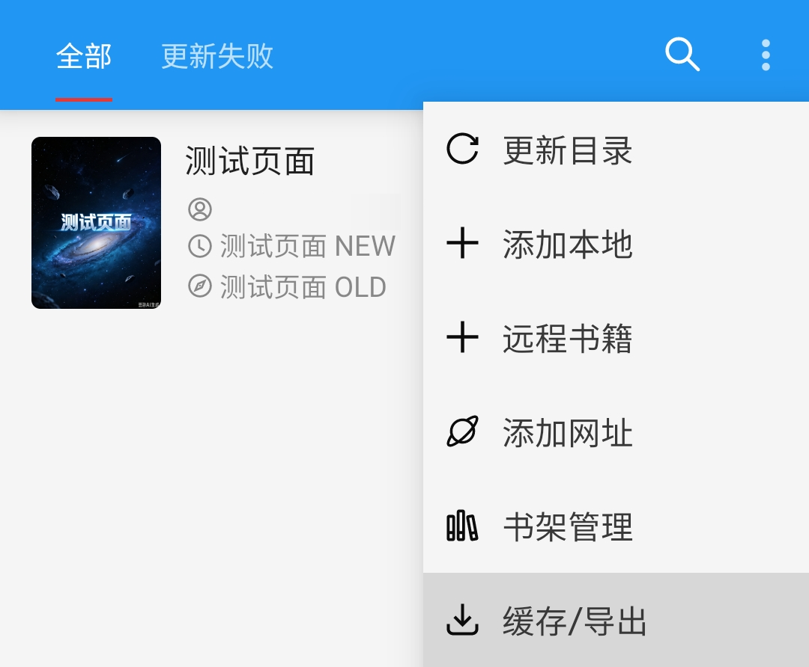
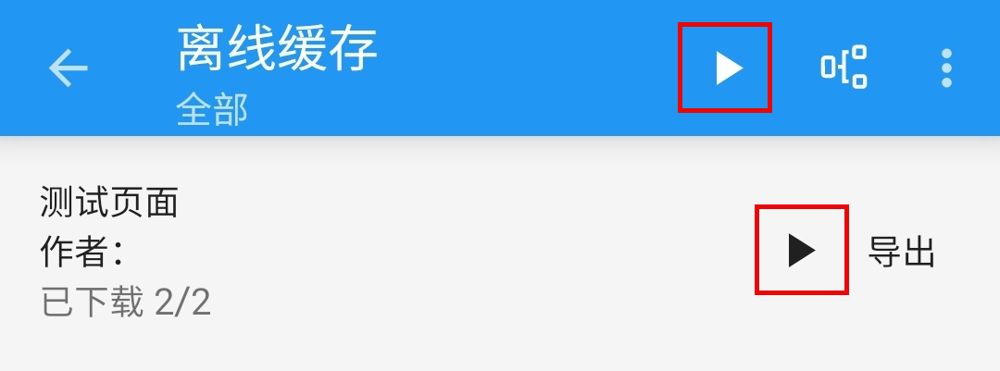
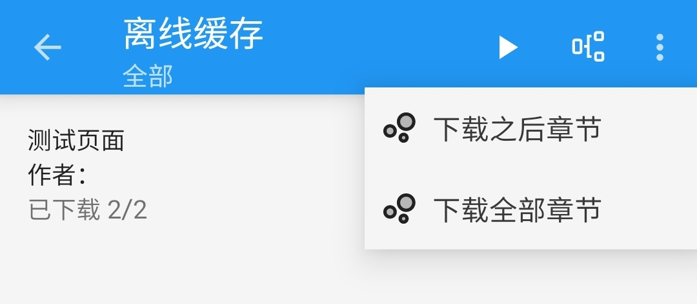
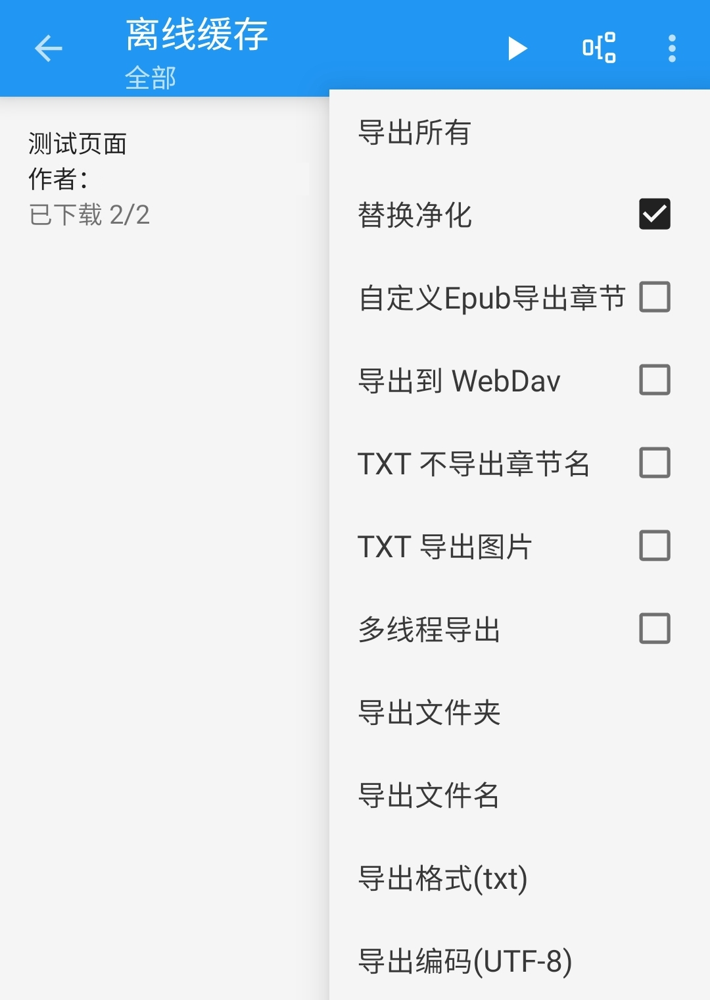

# 开源阅读 使用技巧
#### 🅿️ 开源阅读 Pixiv 书源
#### ✈️ 频道 [@PixivSource](https://t.me/PixivSource)

> [!WARNING]
> ⚠️ **你正在 GitHub 上浏览此文档， Github 文档可能不完整
> [网页版](https://pixivsource.pages.dev/LegadoTips)
> 内容更全面，排版更精美**

## 阅读功能
### 💾 离线缓存 {#OfflineCache}
> [!TIP]
> ✅ 开源阅读软件自带 **离线缓存、导出书籍** 功能
>
> **💾 离线缓存 => 书架界面 - 菜单 - 缓存/导出**
> 
> **⬇️ 导出书籍 => 书架界面 - 菜单 - 缓存/导出**

书架页面，点击右上角菜单，点击【缓存/导出】

点击 **【开始按钮】▶️** ，开始缓存

长按 **【开始按钮】▶️**，可以进入缓存设置

> [!WARNING]
> **不建议短时间内缓存大量章节**

### ⬇️ 导出书籍 {#ExportBooks}
> [!TIP]
> ✅ 开源阅读软件自带 **导出书籍** 功能

进入 [离线阅读](#OfflineCache) 界面后，点击右上角菜单，即可打开书籍导出设置

### 🀄️ 繁简转换 {#ConvertChinese}
> [!TIP]
> ✅ 开源阅读软件自带 **繁简转换** 功能
> 
> **🀄️ 繁简转换 => 小说阅读界面 - 界面 - 简/繁 - 繁简转换**

## 添加小说 {#AddNovels}
> [!TIP]
> ▶️ 添加小说共有4种方法，详见 📖 [添加小说](AddNovels.md)

<!--@include: CommonAddNovelsAddURL.md-->

<!--@include: CommonLegado.md-->

<!--@include: CommonDiscuss.md-->
